# Docker

## 基础

### 概述

官网：https://www.docker.com/  

文档：https://docs.docker.com/

Docker Hub: https://hub.docker.com/ 


项目的需要经过**开发 -- 上线**两个阶段，一般是需要配置两套环境的

传统情况下：开发人员需要将项目打包成 `jar` 包，部署上线需要由 `运维` 来配置相关的环境

使用 **Docker** 后：开发人员打包部署上线，一套流程做完

关键点：**Docker 镜像机制**，允许打包项目时**带上环境**放到 Docker 仓库上，当需要部署上线时，直接运行即可 

> java -> apk -> 发布到应用商店 -> 用户下载使用
>
> java -> jar(带上环境) -> 发布到 Docker 仓库 -> 运维一键部署

核心思想：**隔离** 一个项目一套环境，打包装箱，每个箱子之间是互相隔离的

 

> 与 vm 比较

vm：安装 centos 原生镜像，如果需要环境隔离，就需要配置多个虚拟机，过于笨重


docker: 隔离, **容器化技术并不会模拟一个完整的操作系统**，通过镜像(其中只有最核心的环境 + 自己配置的环境，例如：jdk,mysql等)，运行镜像即可，非常小巧


> DevOps(开发 & 运维)

**更快速的交付和部署** - Docker 打包镜像发布，一键运行

**更便捷的升级和扩缩容** - 项目可以打包成一个镜像，易于实现水平扩展

**更简单的系统运维** - 开发/测试环境高度一致

**更高效的计算资源利用** - Docker 基于内核级别的虚拟化，可以再一个物理机上运行很多的容器实例，压榨服务器的性能(欸嘿)

### 安装

#### 名词解释


**镜像：**可以理解成一个 `类`，可以通过这个 `类` 创建多个容器服务

**容器：**Docker 利用容器技术，独立运行一个/一组应用，通过镜像创建相同的容器，但每个容器之间都是相互隔离的，可以把容器理解成 `一个简易的 Linux 系统`

**仓库：** 存放镜像的地方，可以分为 公有仓库 / 私有仓库

#### Docker 安装

> Linux 环境准备 

```shell
# 查看 linux 内核版本，确保在 3.10 以上
uname -r
```

> 基于 centos 进行安装：https://docs.docker.com/engine/install/centos/

1. 删除旧的版本

   ```shell
   sudo yum remove docker \
               docker-client \
               docker-client-latest \
               docker-common \
               docker-latest \
               docker-latest-logrotate \
               docker-logrotate \
               docker-engine
   ```

2. 安装工具

   ```shell
   sudo yum install -y yum-utils
   ```

3. 配置镜像，这里不推荐使用官方，而是使用阿里云镜像加速

   ```shell
   sudo yum-config-manager \
       --add-repo \
       http://mirrors.aliyun.com/docker-ce/linux/centos/docker-ce.repo
   ```

4. 更新下 `yum` 索引

   ```shell
   yum makecache fast
   ```

5. 安装最新的 Docker(也可以安装其他版本的，看文档)

   ```shell
   sudo yum install docker-ce docker-ce-cli containerd.io
   ```

6. 启动 Docker

   ```shell
   sudo systemctl start docker
   ```

7. 启动 Docker 容器

   ```shell
   sudo docker run hello-world
   ```

   

8. 查看 Docker Images(镜像)

   ```shell
   sudo docker images
   ```

   

> 卸载 Docker

```shell
# 删除相关依赖
sudo yum remove docker-ce docker-ce-cli containerd.io

# 删除相关文件
sudo rm -rf /var/lib/docker
```

#### 配置阿里云镜像加速

1. 登录阿里云

   

2. 获取配置命令

   

3. 在 Linux 中直接输入即可

#### 回顾 Hello World

> Docker run 执行流程


#### 底层原理

> Docker 工作原理

Docker 是基于 C/S 架构的，对应的守护进程运行在宿主机上，可以通过客户端进行访问

DockerServer 接收到 Docker-Client 的指令，就会执行命令


> Docker 比 vm 快的原因

1. Docker 有比虚拟机更少的抽象层(不需要重新构建操作系统内核，而是直接使用宿主机的系统内核)，不需要通过 `Hypervisor` 实现硬件虚拟化，运行在 Docker 容器上的程序直接使用的都是实际物理机的硬件资源，所以 Docker 在 cpu 和内存利用率上更有效率

2. Docker 利用的是宿主机的内核，而 vm 需要重新构建一个操作系统内核(Guest OS)

   

### 常用命令

#### 帮助命令

```shell
docker version		# 查看 docker 版本信息
docker info			# 查看 docker 系统级别的信息
docker 命令 --help   # 查看[命令]的帮助使用
```

docker 命令帮助文档：https://docs.docker.com/reference/

#### 镜像命令

`docker images` 查看本地主机上所有镜像

```shell
[root@VM-0-11-centos ~]# docker images
REPOSITORY    TAG       IMAGE ID       CREATED        SIZE
hello-world   latest    feb5d9fea6a5   3 months ago   13.3kB

# 解释
REPOSITORY		镜像的仓库源
TAG				镜像的标签(版本)
IMAGE ID		镜像id
CREATED			创建时间
SIZE			镜像大小

# 可选项
-a	# 显示所有镜像
-q	# 只显示进行id
```

`docker search` 搜索镜像

```shell
[root@VM-0-11-centos ~]# docker search mysql
NAME                              DESCRIPTION                                     STARS     OFFICIAL   AUTOMATED
mysql                             MySQL is a widely used, open-source relation…   11886     [OK]       
mariadb                           MariaDB Server is a high performing open sou…   4544      [OK]       
```

`docker pull` 下载镜像

```shell
# docker pull 镜像名[:tag(版本)]
[root@VM-0-11-centos ~]# docker pull mysql
Using default tag: latest			# 如果不指定版本(tag)就会默认使用最新的
latest: Pulling from library/mysql
72a69066d2fe: Pull complete 		# 分层下载，Docker Image 核心 --> 联合文件系统
93619dbc5b36: Pull complete 
99da31dd6142: Pull complete 
626033c43d70: Pull complete 
37d5d7efb64e: Pull complete 
ac563158d721: Pull complete 
d2ba16033dad: Pull complete 
688ba7d5c01a: Pull complete 
00e060b6d11d: Pull complete 
1c04857f594f: Pull complete 
4d7cfa90e6ea: Pull complete 
e0431212d27d: Pull complete 
Digest: sha256:e9027fe4d91c0153429607251656806cc784e914937271037f7738bd5b8e7709  # 防伪签名
Status: Downloaded newer image for mysql:latest
docker.io/library/mysql:latest # 镜像的真实地址 -> mysql == docker.io/library/mysql:latest

# 拉取指定版本
[root@VM-0-11-centos ~]# docker pull mysql:5.7
5.7: Pulling from library/mysql
72a69066d2fe: Already exists 		# 由于使用了分层下载，对于相同的部分就不需要下载，节省内存
93619dbc5b36: Already exists 
99da31dd6142: Already exists 
626033c43d70: Already exists 
37d5d7efb64e: Already exists 
ac563158d721: Already exists 
d2ba16033dad: Already exists 
0ceb82207cd7: Pull complete 
37f2405cae96: Pull complete 
e2482e017e53: Pull complete 
70deed891d42: Pull complete 
Digest: sha256:f2ad209efe9c67104167fc609cca6973c8422939491c9345270175a300419f94
Status: Downloaded newer image for mysql:5.7
docker.io/library/mysql:5.7
```

`dokcer rmi` 删除镜像

```shell
# 删除指定 镜像id 的镜像
[root@VM-0-11-centos ~]# docker rmi -f c20
Untagged: mysql:5.7
Untagged: mysql@sha256:f2ad209efe9c67104167fc609cca6973c8422939491c9345270175a300419f94
Deleted: sha256:c20987f18b130f9d144c9828df630417e2a9523148930dc3963e9d0dab302a76
Deleted: sha256:6567396b065ee734fb2dbb80c8923324a778426dfd01969f091f1ab2d52c7989
Deleted: sha256:0910f12649d514b471f1583a16f672ab67e3d29d9833a15dc2df50dd5536e40f
Deleted: sha256:6682af2fb40555c448b84711c7302d0f86fc716bbe9c7dc7dbd739ef9d757150
Deleted: sha256:5c062c3ac20f576d24454e74781511a5f96739f289edaadf2de934d06e910b92

# 删除多个镜像
dokcer rm -f 容器id 容器id

# 删除所有镜像
docker rmi -f $(docker images -qa)
```

#### 容器命令

> 注意：有了镜像才可以创建容器

**新建容器并启动**

```shell
dokcer run [配置参数] image

# 参数说明
--name='NAME'	# 指定容器名
-d				# 以后台方式运行
-it				# 以交互方式运行，可以进入容器内部查看内容
-p				# 指定容器的端口
	-p 主机端口:容器端口
	-p ip地址:主机端口:容器端口
	-p 容器端口
	容器端口
-P				# 随机端口

# 启动并进入容器(使用命令行工具 /bin/bash)
[root@VM-0-11-centos ~]# docker run --name=Centos8 -it centos /bin/bash
[root@47d2aa43c61c /]# 


# 退出容器
[root@47d2aa43c61c /]# exit
exit
[root@VM-0-11-centos ~]# 
```

**列出所有容器**

```shell
dokcer ps [配置参数]

# 参数说明
-a		# 显示当前正在运行的容器 + 运行过的容器
-q		# 显示容器id
-n=num	# 显示最新创建的 num 个容器

[root@VM-0-11-centos ~]# docker ps -qa -n=1
47d2aa43c61c
```

**退出容器**

```shell
exit			# 直接退出并关闭容器
Ctrl + P + Q	# 退出但并不关闭容器
```

**删除容器**

```shell
docker rm [-f] 容器id				# 删除指定容器(-f 为强制删除)
dokcer rm -f $(docker ps -qa)	 # 删除所有容器
```

**启动和停止容器的操作**

```shell
docker start 容器id
docker restart 容器id
docker kill 容器id
docker stop 容器id
```

#### 常用其他命令

**后台启动容器**

```shell
docker run -d 镜像名

# 注意: 这里会有一个坑，docker 容器如果要后台运行，就必须有一个前台进程，docker 发现没有应用，就会自动停止
```

**查看日志**

```shell
# 模拟下数据
[root@VM-0-11-centos ~]# docker run -d centos /bin/sh -c "while true; do echo byqtxdy;sleep 1;done"

# 查看日志
docker logs [可选参数] 容器id

# 参数说明
-t		# 显示时间戳
-f		# 实时显示
-n=num	# 显示 num 条
```

**查看容器中进程信息**

```shell
docker top 容器id
```

**查看镜像的元数据**

```shell
docker inspect 容器id
```

**进入当前正在运行的容器**

```shell
# 方式一:
docker exec -it 容器id 终端命令行(/bin/bash)

# 方式二
docker attach 容器id

## 区别：方式一会开启一个新终端，方式二会进入当前容器正在执行的终端，不会启动新的终端进程
```

**拷贝容器内的文件到主机上**

```shell
docker cp 容器id:容器内部文件路径  主机路径

[root@VM-0-11-centos ~]# docker ps
CONTAINER ID   IMAGE     COMMAND                  CREATED          STATUS          PORTS     NAMES
e106387a99d6   centos    "/bin/sh -c 'while t…"   18 minutes ago   Up 18 minutes             sweet_rubin
[root@VM-0-11-centos ~]# docker rm -f $(docker ps -qa)
e106387a99d6
[root@VM-0-11-centos ~]# clear

# 启动并进入容器
[root@VM-0-11-centos ~]# docker run -it centos /bin/bash
[root@de3b4b55459d /]# cd /home/
[root@de3b4b55459d home]# ls
[root@de3b4b55459d home]# touch test.java
[root@de3b4b55459d home]# ls
test.java

# Ctrl + P + Q -> 回到主机拷贝文件
[root@VM-0-11-centos ~]# docker cp de3b4b55459d:/home/test.java  ./
[root@VM-0-11-centos ~]# ll
total 4
drwxr-xr-x 3 root root 4096 Dec 21 19:08 prover07
-rw-r--r-- 1 root root    0 Dec 30 11:21 test.java

```

#### 小结

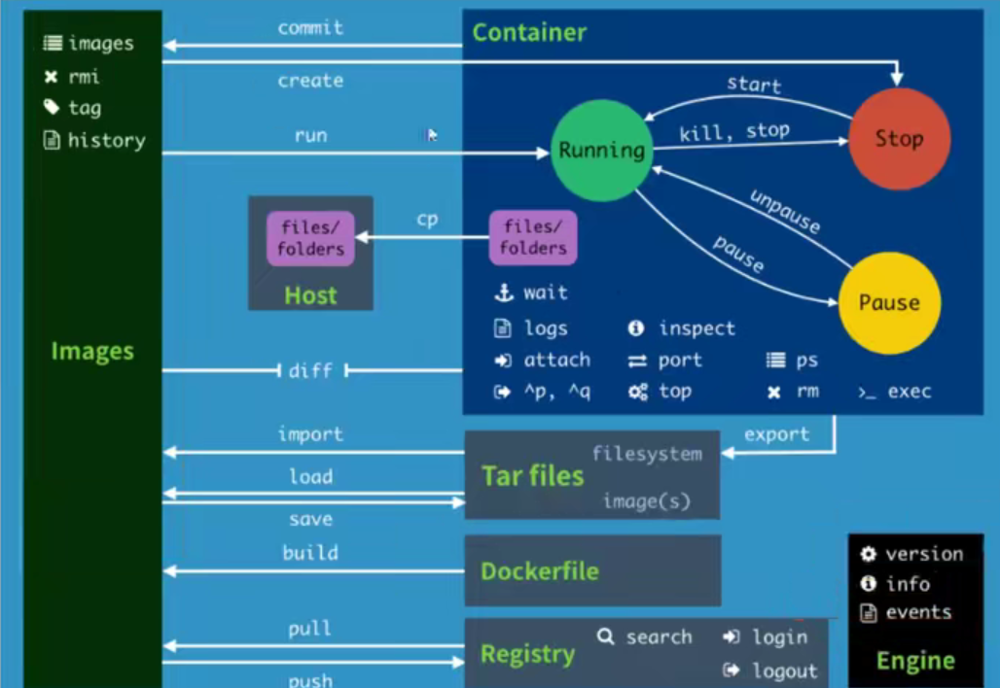

#### 练习

> 安装 Nginx

```shell
# 搜索nginx镜像
[root@VM-0-11-centos ~]# docker search nginx

# 拉取 nginx 镜像
[root@VM-0-11-centos ~]# docker pull nginx

# 启动 nginx 容器
[root@VM-0-11-centos ~]# docker run -d --name=nginx01 -p 3344:80 nginx
```

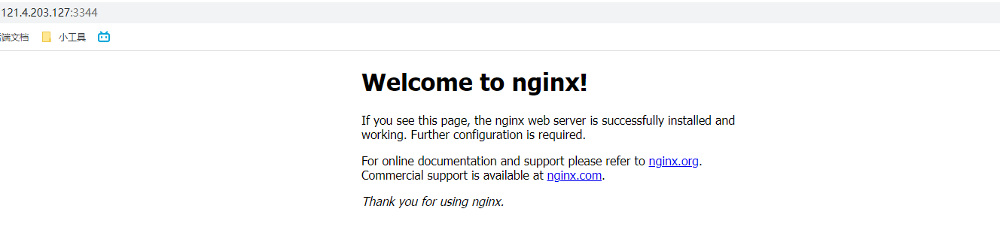

**端口暴露：**将服务器的端口映射到 Docker 容器内部的端口

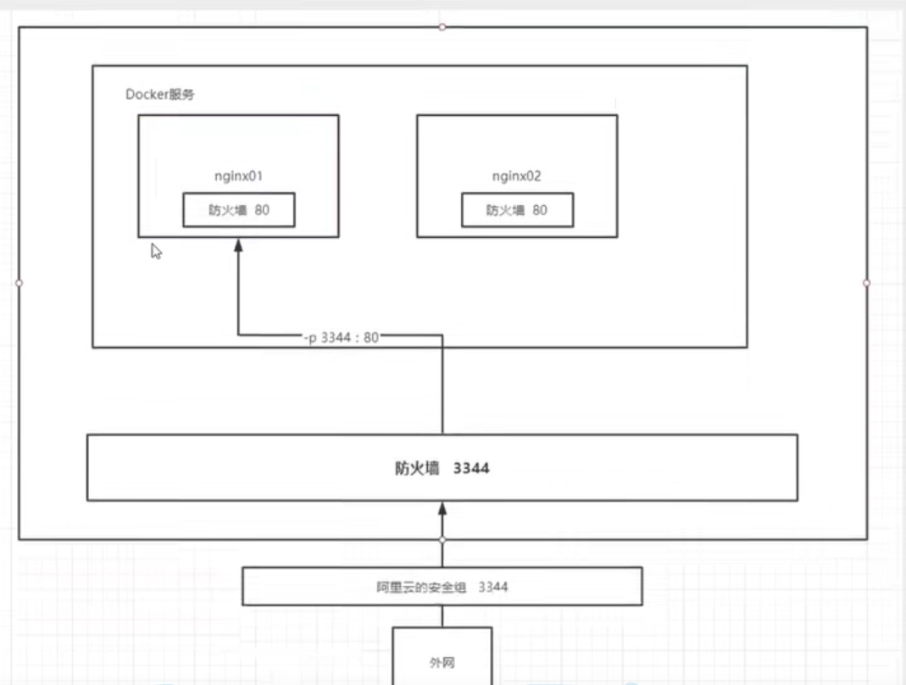

> 安装 Tomcat

```shell
# 拉取镜像
docker pull tomcat

# 启动容器
docker run -d --name tomcat01 -p 3355:8080 tomcat

# 由于阿里云镜像默认是使用的最小镜像，不必要的都会被剔除
# 进入到容器内部
docker exec -it tomcat01 /bin/bash
# 转移文件到 webapps 文件夹下
root@33a946cc2f8c:/usr/local/tomcat# cp -r ./webapps.dist/ ./webapps/
# 退出容器
exit

# 访问即可
```

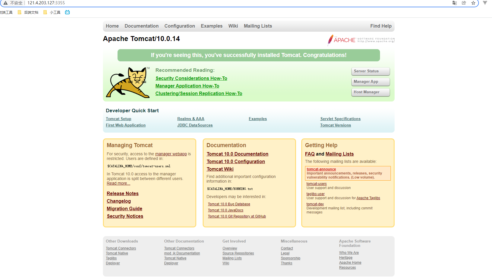

扩展：测试镜像后立刻删除

```shell
docker run -it --rm tomcat:9.0
```

`--rm` 当容器结束删除对应的容器和镜像

> 安装 ElasticSearch

```shell
# 由于 ES 太耗费内存了，所以需要通过 -e 配置环境参数显示它的内存
docker run -d --name elasticsearch -p 9200:9200 -p 9300:9300 -e "discovery.type=single-node" -e ES_JAVA_OPTS="-Xms64m -Xmx512m" elasticsearch:7.6.2

# 测试
[root@VM-0-11-centos ~]# curl localhost:9200
{
  "name" : "31bbc8eb2136",
  "cluster_name" : "docker-cluster",
  "cluster_uuid" : "9ahOqqE5Qq-JtiiVbe3Vpg",
  "version" : {
    "number" : "7.6.2",
    "build_flavor" : "default",
    "build_type" : "docker",
    "build_hash" : "ef48eb35cf30adf4db14086e8aabd07ef6fb113f",
    "build_date" : "2020-03-26T06:34:37.794943Z",
    "build_snapshot" : false,
    "lucene_version" : "8.4.0",
    "minimum_wire_compatibility_version" : "6.8.0",
    "minimum_index_compatibility_version" : "6.0.0-beta1"
  },
  "tagline" : "You Know, for Search"
}
```

扩展：**docker stats 容器id** 查看一个容器的运行情况 


TODO: 通过 docker 安装 kibana 并连接到 es

### 可视化

#### Portainer

> (这个很少用)可以通过网页后台管理为我们提供 Docker 的操作

```shell
# 启动
docker run -d -p 8088:9000 --restart=always -v /var/run/docker.sock:/var/run/docker.sock --privileged=true portainer/portainer
```

通过游览器访问即可

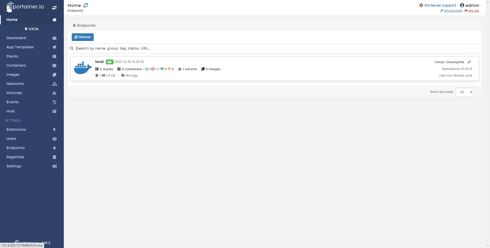

#### Rancher

TODO: CI/CD 中会用

### Docker 镜像讲解

#### 是什么

一种轻量级，可执行的**独立软件包**，用来**打包软件运行环境**和**基于运行环境开发**的软件，它包含运行某个软件所需的所有内容(包括代码，运行时，库，环境变量和配置文件)

代码编写的应用可以打包成 Docker 镜像后，就可以直接跑起来

如何得到镜像：

- 从远程仓库下载
- 朋友拷贝给你
- 通过 **DockerFile** 自己制作一个镜像

#### Docker 镜像加载原理

> UnionFs 联合文件系统

UnionFS：Union 文件系统是一种分层，轻量级并且高性能的文件系统，它支持对文件系统的修改作为一次提交然后记录一次叠加，同时可以将不同目录挂载到同一个虚拟文件系统下。

Union 文件系统是 Docker 镜像的基础，镜像可以通过分层来继承，基于基础镜像，可以制作各种具体的应用镜像

例如：安装 mysql8 和 mysql5，它们底层的部分镜像可能是相同的，那么相同的部分下载一次即可，极大的节省了内存

> Docker 镜像加载原理

docker 的镜像实际上由一层一层的文件系统组成，也就是 **UnionFS**

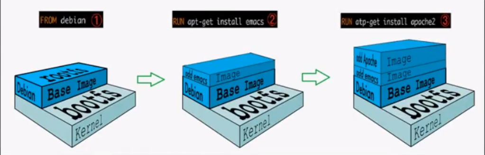

docker 镜像的最底层就是 **bootfs**，这一层与典型的 Linux/Unix 系统一样，包含 boot 加载器和内核，当 boot 加载完成之后整个内核就都在内存中，此时内存的使用权就有 bootfs 转交给内核，系统也会卸载 bootfs

rootfs，在 bootfs 之上，可以理解成不同 Linux 系统的发行版，例如 Ubuntu、Centos 等等

对于 Docker 镜像来说，因为底层可以使用 Host 的 **Kernel**(内核)，只需要提供 rootfs 即可(Linux 发行版同理，对于不同的发行版，boofts 基本是一致的，而 rootfs 会有差别，因此不同的发行版可以公用 boofts)

#### 分层理解

当进行镜像下载时，如果出现了已经下载好的层，就会直接跳过，使用时，会直接调用这个重复的文件(**节省内存**)

docker 通过 `pull` 命令下载的镜像称为 **镜像层**，当我们通过 `run` 命令时，相当于创建一个容器层，所有操作都是在容器层上执行的，最终进行打包时，**会将整个容器和镜像一起打包，就可以直接运行了**

Docker镜像都是只读的，当容器启动时，一个新的可写层被加载到镜像的顶部。这一层通常被称作“容器层”，“容器层”之下的都叫“镜像层”。

```shell
# 可以通过 history 查看镜像历史
[root@VM-0-11-centos ~]# docker history nginx:latest 
IMAGE          CREATED        CREATED BY                                      SIZE      COMMENT
605c77e624dd   13 hours ago   /bin/sh -c #(nop)  CMD ["nginx" "-g" "daemon…   0B        
<missing>      13 hours ago   /bin/sh -c #(nop)  STOPSIGNAL SIGQUIT           0B        
<missing>      13 hours ago   /bin/sh -c #(nop)  EXPOSE 80                    0B        
<missing>      13 hours ago   /bin/sh -c #(nop)  ENTRYPOINT ["/docker-entr…   0B        
<missing>      13 hours ago   /bin/sh -c #(nop) COPY file:09a214a3e07c919a…   4.61kB    
<missing>      13 hours ago   /bin/sh -c #(nop) COPY file:0fd5fca330dcd6a7…   1.04kB    
<missing>      13 hours ago   /bin/sh -c #(nop) COPY file:0b866ff3fc1ef5b0…   1.96kB    
<missing>      13 hours ago   /bin/sh -c #(nop) COPY file:65504f71f5855ca0…   1.2kB     
<missing>      13 hours ago   /bin/sh -c set -x     && addgroup --system -…   61.1MB    
<missing>      13 hours ago   /bin/sh -c #(nop)  ENV PKG_RELEASE=1~bullseye   0B        
<missing>      13 hours ago   /bin/sh -c #(nop)  ENV NJS_VERSION=0.7.1        0B        
<missing>      13 hours ago   /bin/sh -c #(nop)  ENV NGINX_VERSION=1.21.5     0B        
<missing>      9 days ago     /bin/sh -c #(nop)  LABEL maintainer=NGINX Do…   0B        
<missing>      9 days ago     /bin/sh -c #(nop)  CMD ["bash"]                 0B        
<missing>      9 days ago     /bin/sh -c #(nop) ADD file:09675d11695f65c55…   80.4MB    
[root@VM-0-11-centos ~]# docker history centos:latest 
IMAGE          CREATED        CREATED BY                                      SIZE      COMMENT
5d0da3dc9764   3 months ago   /bin/sh -c #(nop)  CMD ["/bin/bash"]            0B        
<missing>      3 months ago   /bin/sh -c #(nop)  LABEL org.label-schema.sc…   0B        
<missing>      3 months ago   /bin/sh -c #(nop) ADD file:805cb5e15fb6e0bb0…   231MB
```

#### Commit 镜像

> 当我们启动一个容器，并对它进行了一个配置后，如果想要保存这个配置，就可以对它进行一个 commit 提交成一个镜像

`docker commit -m "提交信息" -a "作者" 当前需要打包的容器 打包后的镜像名:版本`

```shell
# 启动一个 docker 容器
docker run -d --name tomcat01 -p 8080:8080 tomcat

# 对容器进行定制化处理
[root@VM-0-11-centos ~]# docker exec -it tomcat01 /bin/bash
root@61c2cf9502ed:/usr/local/tomcat# ls
BUILDING.txt  CONTRIBUTING.md  LICENSE	NOTICE	README.md  RELEASE-NOTES  RUNNING.txt  bin  conf  lib  logs  native-jni-lib  temp  webapps  webapps.dist  work
root@61c2cf9502ed:/usr/local/tomcat# cp -r webapps.dist/* webapps/
root@61c2cf9502ed:/usr/local/tomcat# cd webapps
root@61c2cf9502ed:/usr/local/tomcat/webapps# ls
ROOT  docs  examples  host-manager  manager
root@61c2cf9502ed:/usr/local/tomcat/webapps# exit

# 如果将这个容器的环境被保存下来的话，就可以进行 commit，将容器打包成一个镜像
[root@VM-0-11-centos ~]# docker ps 
CONTAINER ID   IMAGE     COMMAND             CREATED          STATUS          PORTS                                       NAMES
61c2cf9502ed   tomcat    "catalina.sh run"   45 seconds ago   Up 44 seconds   0.0.0.0:8080->8080/tcp, :::8080->8080/tcp   tomcat01
[root@VM-0-11-centos ~]# docker commit -m "add webapps" -a "prover" tomcat01 tomcat02:1.0
sha256:9cd7d4cb56b2a8c47adbc0cf477895201644d656e5930b48989f2cabae1c765b
[root@VM-0-11-centos ~]# docker images
REPOSITORY            TAG       IMAGE ID       CREATED         SIZE
tomcat02              1.0       9cd7d4cb56b2   3 seconds ago   684MB
```

注意：这里的打包也会将 tomcat 原生镜像也打包到 tomcat02 中(其实就是在原来的 tomcat 镜像上多加了一层)

### 容器数据卷

#### 概念

可以实现容器的持久化和数据同步，同时可以实现多个容器间的数据共享

#### 使用

> 方式一：使用命令 -v 来挂载

```shell
# docker run -v 主机目录:容器内目录

docker run -it --name tomcat01 -v /home/test:/home tomcat /bin/bash
```

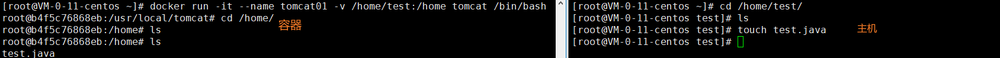

不仅仅支持从目的主机到容器数据, 从容器数据到目的主机

#### 安装 mysql

```shell
# 安装 mysql
docker run -d -p 3310:3306 -v /home/mysql/conf:/etc/mysql/conf.d -v /home/mysql/data:/var/lib/mysql -e MYSQL_ROOT_PASSWORD=123456 --name=mysql01 mysql:5.7
```

#### 分类

具名挂载 | 匿名挂载 | 指定路径挂载

```shell
# 匿名挂载: 使用 -v 挂载数据卷时不指定宿主机数据卷
docker run -d --name tomcat01 -v /home tomcat

# 查看所有数据卷
[root@VM-0-11-centos data]# docker volume ls
DRIVER    VOLUME NAME
local     05ec202c4e3a6574af8d6f6340c341ca066b66f9c422af477b3a9eb6ce29e16d    # 这种一串编码的都是匿名挂载


# 具名挂载： 使用 -v 挂载数据卷时不指定路径而是指定名称(没有以/开头) -> name:容器路径
[root@VM-0-11-centos data]# docker run -d -P --name tomcat02 -v name-mounted:/home tomcat
447a5c9f800fbedab1b4eab30c6774b1bb76b95fccbae4e1a3c0d93003a3ee05
[root@VM-0-11-centos data]# docker volume ls
DRIVER    VOLUME NAME
local     05ec202c4e3a6574af8d6f6340c341ca066b66f9c422af477b3a9eb6ce29e16d
local     6c2d256f374ad208534786e596fe0466c2c409446526e7b66dddaba57948c98b
local     623aa90ea8547ca4ad2e541eb64603ad35746d299f4d08751c98db1e43fde065
local     name-mounted
# 查看一个数据卷的详细数据
[root@VM-0-11-centos data]# docker volume inspect name-mounted 
[
    {
        "CreatedAt": "2021-12-30T19:44:36+08:00",
        "Driver": "local",
        "Labels": null,
        "Mountpoint": "/var/lib/docker/volumes/name-mounted/_data", #具体宿主机挂载目录
        "Name": "name-mounted",
        "Options": null,
        "Scope": "local"
    }
]


# 指定路径挂载 - 就是平常用的(宿主机路径以/开头)
docker run -d -p 3310:3306 -v /home/mysql/conf:/etc/mysql/conf.d -v /home/mysql/data:/var/lib/mysql -e MYSQL_ROOT_PASSWORD=123456 --name=mysql01 mysql:5.7
```

**拓展**：在进行挂载时可以在容器路径后面加上 `:ro(只读) || :rw(可读写)` 限制容器内对该路径的操作(只能通过宿主机外部修改)

#### Dcokerfile

> 常用：通过 Dockerfile 实现容器数据卷

1. 创建配置文件

   > 通过这个配置文件可以生成镜像，镜像是一层一层的，配置文件中的每一行都是一层

   ```dockerfile
   FROM centos
   
   VOLUME ["volume01", "volume02"]
   
   CMD echo "-----end-----"
   
   CMD /bin/bash
   ```

2. 通过配置文件 **构建** 镜像：`docker build -f 配置文件 -t 镜像名:版本号 .`

   ```shell
   [root@VM-0-11-centos home]# docker build -f ./Dockerfile -t prover/centos:1.0 .
   Sending build context to Docker daemon  219.8MB
   Step 1/4 : FROM centos
   ---> 5d0da3dc9764
   Step 2/4 : VOLUME ["volume01", "volume02"]
   ---> Running in 52646342e02d
   Removing intermediate container 52646342e02d
   ---> d0868e957a0f
   Step 3/4 : CMD echo "-----end-----"
   ---> Running in c015f2390aab
   Removing intermediate container c015f2390aab
   ---> 04f5807af636
   Step 4/4 : CMD /bin/bash
   ---> Running in 230031ffd4a7
   Removing intermediate container 230031ffd4a7
   ---> 8d79f7745190
   Successfully built 8d79f7745190
   Successfully tagged prover/centos:1.0
   ```

3. 启动对应镜像的容器

   ```shell
   [root@VM-0-11-centos home]# docker run -it --name test-dockerfile prover/centos:1.0 /bin/bash
   [root@e1ce36b4c5bc /]# ls
   bin  dev  etc  home  lib  lib64  lost+found  media  mnt  opt  proc  root  run  sbin  srv  sys  tmp  usr  var  volume01	volume02
   ```

   通过 `ls` 打印可以发现，`volume01` & `volume02` 挂载文件夹出现了

4. 在 `volume01` 下创建文件, 回到宿主机查看挂载信息

   ```shell
   root@e1ce36b4c5bc volume01]# touch test.java
   [root@e1ce36b4c5bc volume01]# exit
   exit
   
   [root@VM-0-11-centos home]# docker inspect test-dockerfile
   ```

   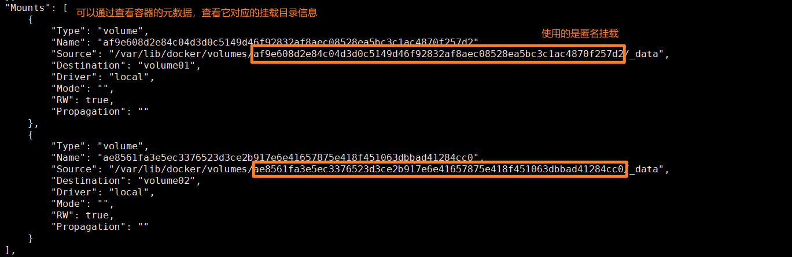

5. 在宿主机上找到对应的挂载目录，康康文件

   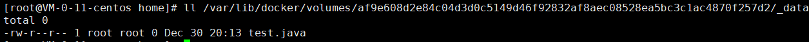

#### 数据卷容器

> 多个容器之间共享数据

`--volumes-from 和哪个容器同步`

```shell
# 先启动一个容器
docker run --name centos1  -it prover/centos:1.0 /bin/bash

# 在容器内部的数据卷中创建文件
[root@3b52263ed64a /]# cd volume01/
[root@3b52263ed64a volume01]# touch test.java

# 退出后创建新的容器2，同时和容器1进行数据卷同步
[root@VM-0-11-centos ~]# docker run --name centos2 -it --volumes-from centos1  prover/centos:1.0 /bin/bash
[root@0c3076463614 /]# cd volume01/
[root@0c3076463614 volume01]# ls
test.java

```

可以通过`docker inspect 容器名`查看容器的挂载信息

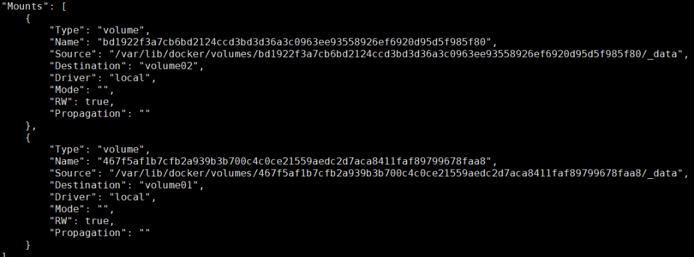

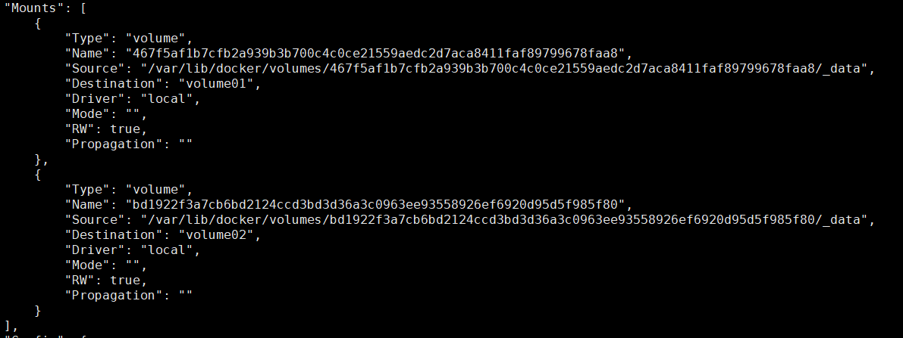

可以发现进行数据卷同步后，它们 Mounts 的信息是一致的

### DockerFile

作用：构建 docker 镜像的配置文件

构建步骤：

1. 编写一个 `dockerfile` 文件
2. docker build 构建成一个镜像
3. docker run 启动镜像
4. docker push 发布镜像(DockHub / 阿里云镜像仓库)

#### 构建过程

**基础知识：**

1. 每个保留关键字(指令)都必须是大写的
2. 执行顺序由上往下
3. \# 表示注释
4. 每一个指令都会提交一个镜像层，并提交

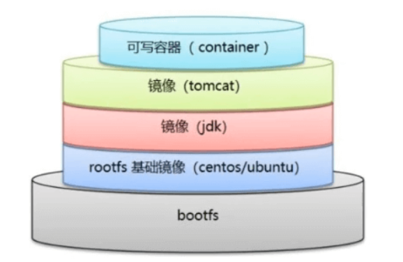

**构建过程：**

1. 为我们的 Spring 项目创建一个 `dockerfile` 文件，并通过指令配置对应的环境
2. 通过 dockerfile 构建我们的镜像 **DockerImages**，也是我们最终发布和运行的产品
3. 运行镜像启动 Docker 容器

#### 指令

```shell
FROM 		# 基础镜像
MAINTAINER	# 镜像是谁写的(名字+邮箱)
RUN 		# 镜像构建时需要运行的命令
ADD			# 添加镜像
WORKDIR		# 设置工作目录
VOLUME		# 设置数据卷
EXPOSE		# 配置端口
CMD			# 指定这个容器启动时要运行的命令，只有最后一个会生效，可被替代
ENTRYPOINT	# 指定这个容器启动时要运行的命令，可以追加命令
ONBUILD		# 触发指令: 当构建一个被继承的 dockerfile 时就会运行 ONBUILD 指令
COPY		# 类似于 ADD 将文件拷贝到镜像中
ENV			# 构建的时候设置环境变量
```


#### 实战

> 构建一个带有 `ifconfig` 和 `vim` 指令的 centos

1. 创建 `dockerfile` 文件

   ```dockerfile
   FROM centos								# 设置基础镜像
   MAINTAINER prover<2391105059@qq.com>	# 设置作者信息
   
   ENV MYPATH /usr/local					# 设置环境变量
   
   WORKDIR $MYPATH							# 设置默认工作路径
   
   RUN yum -y install vim					# 设置构建时需要执行的指令
   RUN yum -y install net-tools
   
   EXPOSE 80								# 设置暴露端口
   
   CMD echo $MYPATH						# 输出
   CMD echo "---end---"
   CMD /bin/bash
   ```

2. 构建镜像 -> `docker build -f 配置文件 -t 镜像名:版本号 .`

   ```shell
   docker build -f ./dockerfile -t custom-centos:1.0 .
   ```

3. 构建成功，查看本地镜像

   ```shell
   Successfully built a09746f148ea
   Successfully tagged custom-centos:1.0
   [root@VM-0-11-centos ~]# docker images
   REPOSITORY            TAG       IMAGE ID       CREATED          SIZE
   custom-centos         1.0       a09746f148ea   23 seconds ago   323MB
   ```

4. 启动镜像

   ```shell
   [root@VM-0-11-centos ~]# docker run -it custom-centos:1.0 
   [root@9f67acdcc439 local]# pwd
   /usr/local
   [root@9f67acdcc439 local]# ifconfig
   eth0: flags=4163<UP,BROADCAST,RUNNING,MULTICAST>  mtu 1500
           inet 172.18.0.6  netmask 255.255.0.0  broadcast 172.18.255.255
           ether 02:42:ac:12:00:06  txqueuelen 0  (Ethernet)
           RX packets 7  bytes 586 (586.0 B)
           RX errors 0  dropped 0  overruns 0  frame 0
           TX packets 0  bytes 0 (0.0 B)
           TX errors 0  dropped 0 overruns 0  carrier 0  collisions 0
   
   lo: flags=73<UP,LOOPBACK,RUNNING>  mtu 65536
           inet 127.0.0.1  netmask 255.0.0.0
           loop  txqueuelen 1000  (Local Loopback)
           RX packets 0  bytes 0 (0.0 B)
           RX errors 0  dropped 0  overruns 0  frame 0
           TX packets 0  bytes 0 (0.0 B)
           TX errors 0  dropped 0 overruns 0  carrier 0  collisions 0
   ```

> 扩展：查看一个镜像的提交过程

**docker history 镜像id**

```shell
[root@VM-0-11-centos ~]# docker history 605c77e624dd
IMAGE          CREATED        CREATED BY                                      SIZE      COMMENT
605c77e624dd   30 hours ago   /bin/sh -c #(nop)  CMD ["nginx" "-g" "daemon…   0B        
<missing>      30 hours ago   /bin/sh -c #(nop)  STOPSIGNAL SIGQUIT           0B        
<missing>      30 hours ago   /bin/sh -c #(nop)  EXPOSE 80                    0B        
<missing>      30 hours ago   /bin/sh -c #(nop)  ENTRYPOINT ["/docker-entr…   0B        
<missing>      30 hours ago   /bin/sh -c #(nop) COPY file:09a214a3e07c919a…   4.61kB    
<missing>      30 hours ago   /bin/sh -c #(nop) COPY file:0fd5fca330dcd6a7…   1.04kB    
<missing>      30 hours ago   /bin/sh -c #(nop) COPY file:0b866ff3fc1ef5b0…   1.96kB    
<missing>      30 hours ago   /bin/sh -c #(nop) COPY file:65504f71f5855ca0…   1.2kB     
<missing>      30 hours ago   /bin/sh -c set -x     && addgroup --system -…   61.1MB    
<missing>      30 hours ago   /bin/sh -c #(nop)  ENV PKG_RELEASE=1~bullseye   0B        
<missing>      30 hours ago   /bin/sh -c #(nop)  ENV NJS_VERSION=0.7.1        0B        
<missing>      30 hours ago   /bin/sh -c #(nop)  ENV NGINX_VERSION=1.21.5     0B        
<missing>      9 days ago     /bin/sh -c #(nop)  LABEL maintainer=NGINX Do…   0B        
<missing>      10 days ago    /bin/sh -c #(nop)  CMD ["bash"]                 0B        
<missing>      10 days ago    /bin/sh -c #(nop) ADD file:09675d11695f65c55…   80.4MB a
```

> 扩展：CMD 和 ENTRYPOINT 的区别

CMD: 只有最后一条命令被执行，可能会被替代

```shell
# 创建配置文件
[root@VM-0-11-centos ~]# vim docker-test-cmd
[root@VM-0-11-centos ~]# cat docker-test-cmd 
FROM centos
CMD ["ls", "-a"]

# 构建镜像
[root@VM-0-11-centos ~]# docker build -f docker-test-cmd -t docker-test-cmd:1.0 .
Sending build context to Docker daemon  2.924MB
Step 1/2 : FROM centos
 ---> 5d0da3dc9764
Step 2/2 : CMD ["ls", "-a"]
 ---> Running in a6d048080df4
Removing intermediate container a6d048080df4
 ---> 4c009e7c57db
Successfully built 4c009e7c57db
Successfully tagged docker-test-cmd:1.0

# 启动镜像
[root@VM-0-11-centos ~]# docker run -it 4c009e7c57db
.   .dockerenv	dev  home  lib64       media  opt   root  sbin	sys  usr
..  bin		etc  lib   lost+found  mnt    proc  run   srv	tmp  var

# 由于 CMD 指令会被替代，所以在启动镜像的时候如果只指定 -l 就会导致配置的`ls -a`被替代，而 `-l` 本身不是指令，所以会报错
[root@VM-0-11-centos ~]# docker run -it 4c009e7c57db -l
docker: Error response from daemon: OCI runtime create failed: container_linux.go:380: starting container process caused: exec: "-l": executable file not found in $PATH: unknown.

# 使用 ls -la 代替 ls -a
[root@VM-0-11-centos ~]# docker run -it 4c009e7c57db ls -la
total 56
drwxr-xr-x   1 root root 4096 Dec 31 01:41 .
drwxr-xr-x   1 root root 4096 Dec 31 01:41 ..
-rwxr-xr-x   1 root root    0 Dec 31 01:41 .dockerenv
lrwxrwxrwx   1 root root    7 Nov  3  2020 bin -> usr/bin
drwxr-xr-x   5 root root  360 Dec 31 01:41 dev
drwxr-xr-x   1 root root 4096 Dec 31 01:41 etc
...
```

ENTRYPOINT: 支持追加命令

```shell
# 创建配置文件
[root@VM-0-11-centos ~]# vim docker-test-entrypoint
[root@VM-0-11-centos ~]# cat docker-test-entrypoint 
FROM centos
ENTRYPOINT ["ls", "-a"] 

# 构建镜像
[root@VM-0-11-centos ~]# docker build -f ./docker-test-entrypoint -t docker-test-entrypoint:1.0 .
...
Successfully built 4739a91f1a40
Successfully tagged docker-test-entrypoint:1.0

# 启动容器
[root@VM-0-11-centos ~]# docker run -it docker-test-entrypoint:1.0 
.   .dockerenv	dev  home  lib64       media  opt   root  sbin	sys  usr
..  bin		etc  lib   lost+found  mnt    proc  run   srv	tmp  var
# 可以直接上 `-l` 指令追加到 `ls -a` 后面
[root@VM-0-11-centos ~]# docker run -it docker-test-entrypoint:1.0 -l
total 56
drwxr-xr-x  1 root root 4096 Dec 31 01:48 .
drwxr-xr-x  1 root root 4096 Dec 31 01:48 ..
-rwxr-xr-x  1 root root    0 Dec 31 01:48 .dockerenv
lrwxrwxrwx  1 root root    7 Nov  3  2020 bin -> usr/bin
drwxr-xr-x  5 root root  360 Dec 31 01:48 dev
drwxr-xr-x  1 root root 4096 Dec 31 01:48 etc
drwxr-xr-x  2 root root 4096 Nov  3  2020 home
...
```

#### 构建 Tomcat 镜像

1. 准备环境 `readme.md` `apache-tomcat-9.0.56.tar.gz` `jdk-8u311-linux-x64.tar.gz`

   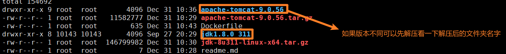

2. 创建 `Dockerfile` 文件

   ```dockerfile
   FROM centos
   MAINTAINER prover<2391105059@qq.com>
   
   # 复制文件到容器内
   COPY readme.md /usr/local/readme.md
   
   # 添加文件镜像
   ADD jdk-8u311-linux-x64.tar.gz /usr/local/
   ADD apache-tomcat-9.0.56.tar.gz /usr/local/
   
   RUN yum -y install vim
   
   ENV MYPATH /usr/local
   WORKDIR $MYPATH
   
   # 设置 jdk 和 tomcat 环境变量
   ENV JAVA_HOME /usr/local/jdk1.8.0_311
   ENV CLASSPATH $JAVA_HOME/lib/dt.jar:$JAVA_HOME/lib/tools.jar
   ENV CATALINA_HOME /usr/local/apache-tomcat-9.0.56
   ENV CATALINA_BASH /usr/local/apache-tomcat-9.0.56
   ENV PATH $PATH:$JAVA_HOME/bin:$CATALINA_HOME/lib:$CATALINA_HOME/bin
   
   # 开发端口
   EXPOSE 8080
   
   # 启动容器后立即启动 tomcat
   CMD /usr/local/apache-tomcat-9.0.56/bin/startup.sh && tail -F /url/local/apache-tomcat-9.0.56/bin/logs/catalina.out
   ```

3. 构建镜像, 如果不指定 `-f 文件名`默认找的就是当前目录下的 **Dockerfile** 文件

   ```shell
   docker build -t my-tomcat .
   ```

4. 启动容器，通过 -v 挂载数据卷

   ```shell
   docker run -d -p 9090:8080 --name provertomcat \ 
   -v /home/prover/build/tomcat/test:/usr/local/apache-tomcat-9.0.56/webapps/test \ 
   -v /home/prover/build/tomcat/tomcatlogs:/usr/local/apache-tomcat-9.0.56/logs \ 
   my-tomcat:1.0 
   ```

5. 可以访问 9090 端口试试，然后进入到 `/home/prover/build/tomcat/test` 目录

   创建 **WEB-INF** 文件夹并配置 `web.xml`

   ```xml
   mkdir WEB-INF
   cd WEB-INF
   touch web.xml
   
   vim web.xml
   <web-app version="2.4" 
       xmlns="http://java.sun.com/xml/ns/j2ee" 
       xmlns:xsi="http://www.w3.org/2001/XMLSchema-instance"
       xsi:schemaLocation="http://java.sun.com/xml/ns/j2ee 
           http://java.sun.com/xml/ns/j2ee/web-app_2_4.xsd">
           
   </web-app>
   ```

   在 `test` 目录下创建 index.jsp

   ```jsp
   <%@ page language="java" contentType="text/html; charset=UTF-8"
       pageEncoding="UTF-8"%>
   <!DOCTYPE html>
   <html>
       <head>
           <meta charset="utf-8">
           <title>hello. xiaofan</title>
       </head>
       <body>
           Hello World!<br/>
           <%
           System.out.println("-----prover test web logs------");
           %>
       </body>
   </html>
   ```

6. 访问 ip:9090/test

   

7. 查看日志输出

   ```shell
   # 进入到挂载的日志文件夹
   [root@VM-0-11-centos test]# cd ../tomcatlogs/
   
   # 查看 catalina.out 文件
   [root@VM-0-11-centos tomcatlogs]# cat catalina.out
   ...
   31-Dec-2021 02:55:32.538 INFO [Catalina-utility-1] org.apache.catalina.core.StandardContext.reload Reloading Context with name [/test] is completed
   -----prover test web logs------
   ```

#### 发布镜像

> 发布到 DockerHub

```shell
# 先登录到 Dockerhub(哦，记得先注册，混蛋)
[root@VM-0-11-centos tomcatlogs]# docker login -u prover07
# 输入密码
Password: 
WARNING! Your password will be stored unencrypted in /root/.docker/config.json.
Configure a credential helper to remove this warning. See
https://docs.docker.com/engine/reference/commandline/login/#credentials-store

Login Succeeded

# 修改镜像名
[root@VM-0-11-centos tomcatlogs]# docker tag 20ed4f4dee0c prover07/my-tomcat:1.0

# 发布镜像(也是分层发布的)
[root@VM-0-11-centos tomcatlogs]# docker push prover07/my-tomcat:1.0 
The push refers to repository [docker.io/prover07/my-tomcat]
94fadfd7ccea: Pushing [>                                                  ]  546.3kB/64.73MB
af14137f2624: Pushing [=>                                                 ]  522.8kB/16.06MB
ce1b0d9d2d74: Pushing [>                                                  ]   1.08MB/365.3MB
8828b567f3d7: Pushing [==================================================>]  3.072kB
```

> 发布到阿里云镜像仓库

1. 登录阿里云

2. 找到容器镜像服务

   

3. 创建命名空间

   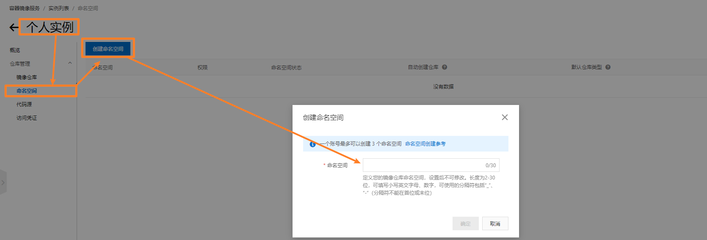

4. 创建仓库

   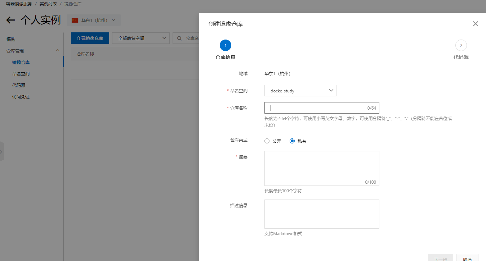

   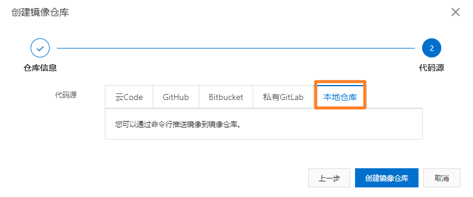

5. 在本地通过 docker 登录阿里云镜像服务

   ```shell
   # 注意：密码是刚刚创建个人实例时配置的
   [root@VM-0-11-centos ~]# docker login --username=巴御前天下第一 registry.cn-hangzhou.aliyuncs.com
   Password: 
   
   # 将镜像重命名
   [root@VM-0-11-centos ~]# docker tag 580c0e4e98b0 registry.cn-hangzhou.aliyuncs.com/docke-study/tomcat02:1.0
   # 推送指定镜像
   [root@VM-0-11-centos ~]# docker push registry.cn-hangzhou.aliyuncs.com/docke-study/tomcat02:1.0 
   The push refers to repository [registry.cn-hangzhou.aliyuncs.com/docke-study/tomcat02]
   658693958bcb: Pushing [=>                                                 ]  1.639MB/78.87MB
   11bdf2a940a7: Pushing  1.536kB
   8dfce63a7397: Pushing [==================================================>]  217.6kB
   ```

6. 也可以在阿里云控制台查看

   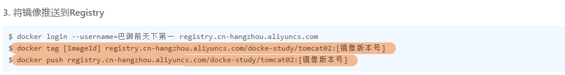

### Docker 网络

#### 理解 Docker0

> 观察服务器的网卡配置

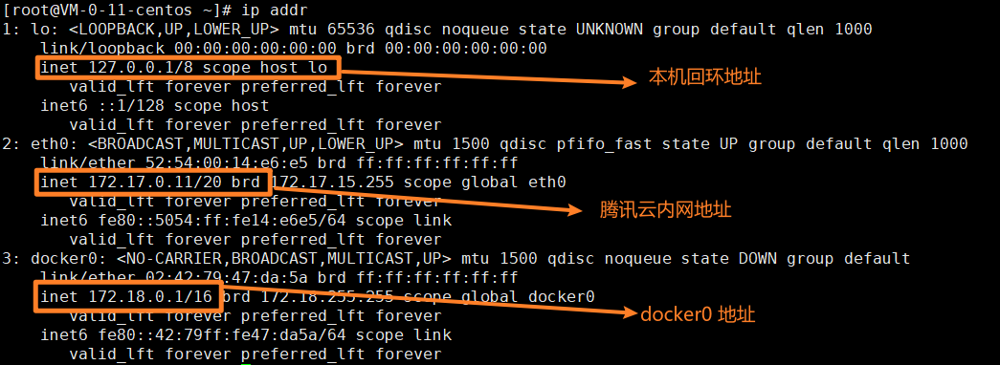

> 问题：宿主机能否 ping 通 docker 容器

```shell
apt update && apt install -y iproute2

# 启动一个 tomcat docker 容器
docker run -d -P --name tomcat01 tomcat

# 安装网络工具
docker exec -it tomcat01 /bin/bash


# 查看容器网络信息
[root@VM-0-11-centos ~]# docker exec -it tomcat01 ip addr
1: lo: <LOOPBACK,UP,LOWER_UP> mtu 65536 qdisc noqueue state UNKNOWN group default qlen 1000
    link/loopback 00:00:00:00:00:00 brd 00:00:00:00:00:00
    inet 127.0.0.1/8 scope host lo
       valid_lft forever preferred_lft forever
16: eth0@if17: <BROADCAST,MULTICAST,UP,LOWER_UP> mtu 1500 qdisc noqueue state UP group default 
    link/ether 02:42:ac:12:00:02 brd ff:ff:ff:ff:ff:ff link-netnsid 0
    inet 172.18.0.2/16 brd 172.18.255.255 scope global eth0
       valid_lft forever preferred_lft forever

# 使用宿主机 ping docker 容器
[root@VM-0-11-centos ~]# ping 172.18.0.2
PING 172.18.0.2 (172.18.0.2) 56(84) bytes of data.
64 bytes from 172.18.0.2: icmp_seq=1 ttl=64 time=0.046 ms
64 bytes from 172.18.0.2: icmp_seq=2 ttl=64 time=0.045 ms
```

总结：安装了 docker 的宿主机可以与 docker 容器互通

原理：

1. 处于同一个网段下(TODO: 计算机网络)

2. 当我们在宿主机上安装了 docker 容器后，就会有一个新网卡 docker0(使用桥接模式)；而当我们每启动一个 docker 容器，docker 就会给它分配一个新网卡，而这里的容器网卡就会使用 **veth-pair** 技术

   当我们启动一个新容器后，可以在宿主机上使用 `ip addr` 进行测试

   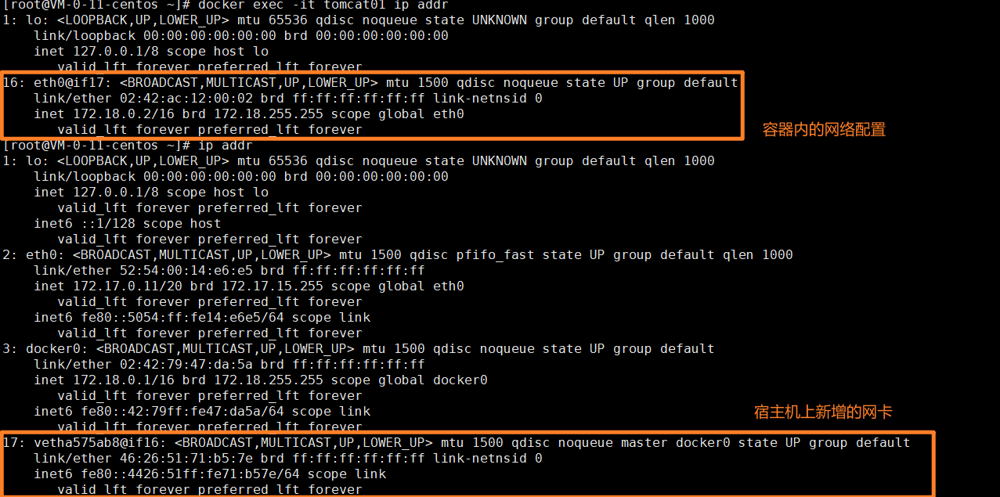

3. **evth-pair:**

   - 是一对的虚拟设备接口，都是成对出现，一端连接着协议，一端彼此相连
   - 通常用于连接各种虚拟网络设备

> 问题：容器1能否 ping 通容器2

```shell
# 安装 ping 工具
[root@VM-0-11-centos ~]# docker exec -it tomcat02 apt-get update && apt-get install inetutils-ping
	
# 测试能否 ping 通另一个容器
[root@VM-0-11-centos ~]# docker exec -it tomcat02 ping 172.18.0.2
PING 172.18.0.2 (172.18.0.2): 56 data bytes
64 bytes from 172.18.0.2: icmp_seq=0 ttl=64 time=0.089 ms
64 bytes from 172.18.0.2: icmp_seq=1 ttl=64 time=0.068 ms
```

总结：可以

原理：在启动容器不通过 `-net` 指定网络时，默认使用的都是 docker0 进行路由的，docker 会给我们的容器默认分配一个可用的 ip

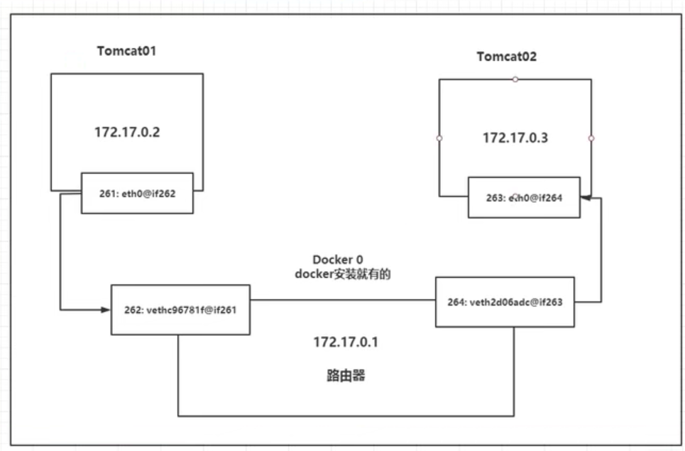

> 总结

Docker 容器间的网络连接使用的是 Linux 的 **桥接模式**(veth-pair 技术)，而 docker0 就是宿主机中 Docker 容器间的一个网桥

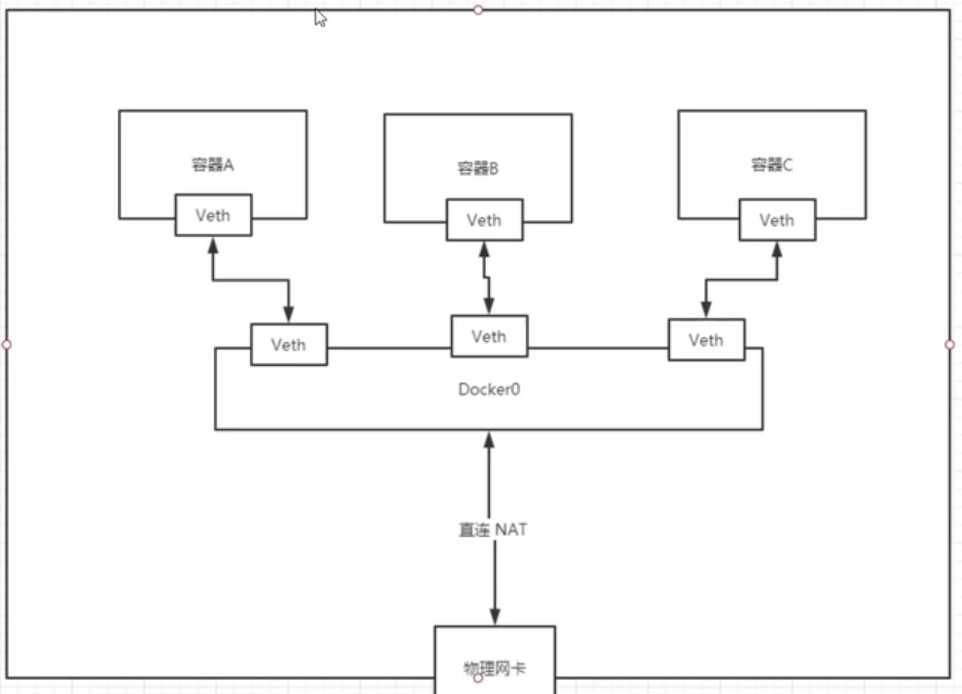

核心：使用 Linux 的虚拟化网络技术，在我们的容器内和 docker0分别创建了一个虚拟网卡，通过 veth-pair 进行一个连接 

> 存在问题：能否实现高可用 - 当我们通过 docker 部署开发环境(mysql/redis等)时由于 docker0 每次分配的 ip 可能不同，所以能否通过我们的容器名来连接环境，而不是通过 ip 地址
>
> **解决方案：容器互联**

#### --link

> 少用

作用：通过容器名访问容器，而不是通过 ip 地址

实践：

```shell
# 在启动容器时配置
docker run -d -P --name tomcat03 --link tomcat02 tomcat

# 测试能否ping通 -> 注意这里 t3 可以访问 t2，但 t2 不能访问 t3
[root@VM-0-11-centos ~]# docker exec -it tomcat03 ping tomcat02
PING tomcat02 (172.18.0.2): 56 data bytes
64 bytes from 172.18.0.2: icmp_seq=0 ttl=64 time=0.116 ms
64 bytes from 172.18.0.2: icmp_seq=1 ttl=64 time=0.078 ms
```

总结：在启动时进行相关配置后就可以通过容器名访问对应的容器

原理：通过配置 hosts 文件实现

```shell
# 查看 t3 的 hosts 文件
[root@VM-0-11-centos ~]# docker exec -it tomcat03 cat /etc/hosts
127.0.0.1	localhost
::1	localhost ip6-localhost ip6-loopback
fe00::0	ip6-localnet
ff00::0	ip6-mcastprefix
ff02::1	ip6-allnodes
ff02::2	ip6-allrouters
172.18.0.2	tomcat02 88958bdc767c
172.18.0.3	9dd28d3913e0
```

#### 自定义网络

> 查看所有的 docker 网络

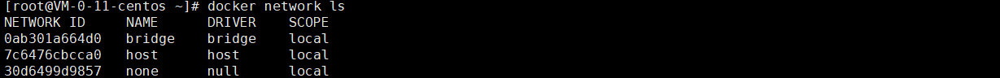

网络模式：

- bridge：桥接模式(默认)
- none：不配置网络
- host：主机模式，和宿主机共享网络
- container：容器内网络联通(用的少，局限性很大)

使用：

```shell
# 默认情况下使用的是 bridge 网络模式(下面两条命令相同)
docker run -d -P --name tomcat01 --net bridge tomcat
docker run -d -P --name tomcat01 tomcat

# 创建自定义网络
# driver：使用的模式
# subnet：子网地址
# gateway：网关地址
[root@VM-0-11-centos ~]# docker network create --driver bridge --subnet 192.168.0.0/16 --gateway 192.168.0.1 mynet
b365cfa26f1ea4be5258be7bffee32fe6a713883a1a2b797c2e046b939154f1d

# 查看网络的详细配置
[root@VM-0-11-centos ~]# docker network ls
NETWORK ID     NAME      DRIVER    SCOPE
0ab301a664d0   bridge    bridge    local
7c6476cbcca0   host      host      local
b365cfa26f1e   mynet     bridge    local
30d6499d9857   none      null      local
[root@VM-0-11-centos ~]# docker network inspect b365cfa26f1e
[
    {
        "Name": "mynet",
        "Id": "b365cfa26f1ea4be5258be7bffee32fe6a713883a1a2b797c2e046b939154f1d",
        "Created": "2022-01-03T20:28:40.917898518+08:00",
        "Scope": "local",
        "Driver": "bridge",
        "EnableIPv6": false,
        "IPAM": {
            "Driver": "default",
            "Options": {},
            "Config": [
                {
                    "Subnet": "192.168.0.0/16",
                    "Gateway": "192.168.0.1"
                }
            ]
        },
        "Internal": false,
        "Attachable": false,
        "Ingress": false,
        "ConfigFrom": {
            "Network": ""
        },
        "ConfigOnly": false,
        "Containers": {},
        "Options": {},
        "Labels": {}
    }
]

# 启动容器时指定网络
[root@VM-0-11-centos ~]# docker run -d -P --name tomcat01 --net mynet tomcat
e0192fc0812301bbb77971475149343e99fc31567add4b63aa474c5e09849ec0
[root@VM-0-11-centos ~]# docker run -d -P --name tomcat02 --net mynet tomcat
d404ab4c20c2c72e2bfa079e7d83acba7edbd7d8b008304e60ecf14e543d7733

# 查看使用该网络的容器
[root@VM-0-11-centos ~]# docker network inspect b365cfa26f1e
[
    {
        "Name": "mynet",
        "Id": "b365cfa26f1ea4be5258be7bffee32fe6a713883a1a2b797c2e046b939154f1d",
        "Created": "2022-01-03T20:28:40.917898518+08:00",
        "Scope": "local",
        "Driver": "bridge",
        "EnableIPv6": false,
        "IPAM": {
            "Driver": "default",
            "Options": {},
            "Config": [
                {
                    "Subnet": "192.168.0.0/16",
                    "Gateway": "192.168.0.1"
                }
            ]
        },
        "Internal": false,
        "Attachable": false,
        "Ingress": false,
        "ConfigFrom": {
            "Network": ""
        },
        "ConfigOnly": false,
        ### 可以在这里查看使用给网络的容器以及相关的网络信息
        "Containers": {
            "d404ab4c20c2c72e2bfa079e7d83acba7edbd7d8b008304e60ecf14e543d7733": {
                "Name": "tomcat02",
                "EndpointID": "1761d9d8ae6de80f486b727ed2e93b5a258c069b3bae3400f650f58982e04bf7",
                "MacAddress": "02:42:c0:a8:00:03",
                "IPv4Address": "192.168.0.3/16",
                "IPv6Address": ""
            },
            "e0192fc0812301bbb77971475149343e99fc31567add4b63aa474c5e09849ec0": {
                "Name": "tomcat01",
                "EndpointID": "4834cae7627464f1a1a2b88f81d219dc7a70f1d272d14fa05ba28c7175faef76",
                "MacAddress": "02:42:c0:a8:00:02",
                "IPv4Address": "192.168.0.2/16",
                "IPv6Address": ""
            }
        },
        "Options": {},
        "Labels": {}
    }
]

# 测试能否 ping 通
[root@VM-0-11-centos ~]# docker exec -it tomcat01 ping tomcat02
PING tomcat02 (192.168.0.3): 56 data bytes
64 bytes from 192.168.0.3: icmp_seq=0 ttl=64 time=0.101 ms
64 bytes from 192.168.0.3: icmp_seq=1 ttl=64 time=0.067 ms
64 bytes from 192.168.0.3: icmp_seq=2 ttl=64 time=0.074 ms
```

总结：自定义的 docker 网络会自动帮我们维护好对应的关系，同时也推荐平时我们这样去使用 docker 网络

好处：对于不同的生成环境配置(redis/mysql/等)如果要部署集群，就可以使用这种模式，通过**创建不同自定义网络来使其分配在不同的子网下**，实现**集群健康** - 对于跨集群网络的访问解决方案: **网络连通**

#### 网络连通

作用：实现 docker 内部跨网络的容器访问

实现：、

```shell
# 默认情况下，跨网络的容器无法访问
[root@VM-0-11-centos ~]# clear
[root@VM-0-11-centos ~]# docker exec -it tomcat01 ping tomcat-default-01 
ping: unknown host

# 实现网络连通
# 通过 docker network connect [网络名] [容器名]
[root@VM-0-11-centos ~]# docker network connect mynet tomcat-default-01 
# 查看网络详细配置
[root@VM-0-11-centos ~]# docker network inspect mynet 
[
    {
        "Name": "mynet",
        ...
        "Containers": {
            "733374d2a43fa74feff6e71c6f88d111aa4f4d6e475c7681e6e969ac0f03f16d": {
                "Name": "tomcat-default-01",
                "EndpointID": "d6dc5737f6581f52629908d1c59a506f38532b3ec377fe7d23b4f6eb9ca52195",
                "MacAddress": "02:42:c0:a8:00:04",
                "IPv4Address": "192.168.0.4/16",
                "IPv6Address": ""
            },
            "d404ab4c20c2c72e2bfa079e7d83acba7edbd7d8b008304e60ecf14e543d7733": {
                "Name": "tomcat02",
                "EndpointID": "1761d9d8ae6de80f486b727ed2e93b5a258c069b3bae3400f650f58982e04bf7",
                "MacAddress": "02:42:c0:a8:00:03",
                "IPv4Address": "192.168.0.3/16",
                "IPv6Address": ""
            },
            "e0192fc0812301bbb77971475149343e99fc31567add4b63aa474c5e09849ec0": {
                "Name": "tomcat01",
                "EndpointID": "4834cae7627464f1a1a2b88f81d219dc7a70f1d272d14fa05ba28c7175faef76",
                "MacAddress": "02:42:c0:a8:00:02",
                "IPv4Address": "192.168.0.2/16",
                "IPv6Address": ""
            }
        },
        ...
    }
]
```

原理：观察 `docker network inspect `可以发现，它就是**额外为容器分配了一个 ip 地址**，类似于一个宿主机可以配置多个网络，这样 `tomcat-default-01` 和这个网络下的两个容器都可以互相访问

```shell
[root@VM-0-11-centos ~]# docker exec -it tomcat01 ping tomcat-default-01 
PING tomcat-default-01 (192.168.0.4): 56 data bytes
64 bytes from 192.168.0.4: icmp_seq=0 ttl=64 time=0.088 ms
64 bytes from 192.168.0.4: icmp_seq=1 ttl=64 time=0.078 ms
```

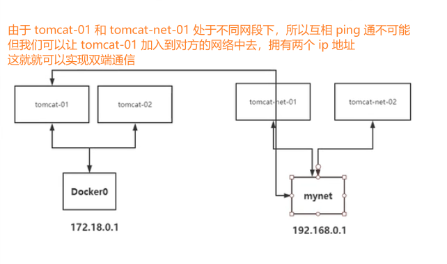

####  实战：部署 redis 集群

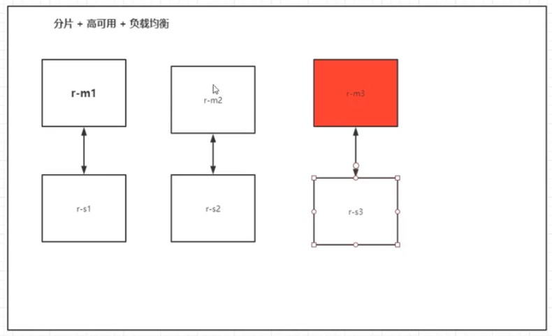

```shell
# 创建网络配置
docker network create my-redis --subnet 172.88.0.0/16

# 通过脚本快速创建 redis 配置文件
for port in $(seq 1 6); \
do \ 
mkdir -p /mydata/redis/node-${port}/conf 
touch /mydata/redis/node-${port}/conf/redis.conf
cat << EOF >/mydata/redis/node-${port}/conf/redis.conf
port 6379
bind 0.0.0.0
cluster-enabled yes
cluster-config-file nodes.conf
cluster-node-timeout 5000
cluster-announce-ip 172.88.0.1${port}
cluster-announce-port 6379
cluster-announce-bus-port 16379
appendonly yes
EOF
done

# 依次通过 redis 启动6个节点
docker run -p 6371:6379 -p 16371:16379 --name redis-1 -v /mydata/redis/node-1/data:/data -v /mydata/redis/node-1/conf/redis.conf:/etc/redis/redis.conf -d --net my-redis --ip 172.88.0.11 redis:5.0.9-alpine3.11 redis-server /etc/redis/redis.conf;

docker run -p 6372:6379 -p 16372:16379 --name redis-2 -v /mydata/redis/node-2/data:/data -v /mydata/redis/node-2/conf/redis.conf:/etc/redis/redis.conf -d --net my-redis --ip 172.88.0.12 redis:5.0.9-alpine3.11 redis-server /etc/redis/redis.conf;

...

# 进入到容器内部
[root@VM-0-11-centos conf]# docker exec -it redis-1 /bin/sh
# 开启 redis 集群
/data # redis-cli --cluster create 172.88.0.11:6379 172.88.0.12:6379 172.88.0.13:6379 172.88.0.14:6379 172.88.0.15:6379 172.88.0.16:6379 --cluster-replicas 1

# 连接到 redis 集群
/data # redis-cli -c
# 查看集群信息
127.0.0.1:6379> cluster info
# 查看集群节点信息
127.0.0.1:6379> cluster nodes
df79bf4c2c142e02cd035dc8d9b7aa879c4b6182 172.88.0.14:6379@16379 slave 9cd8aee678b4f13e3f0268905c395c157e5268a7 0 1641219032582 4 connected
b154cf28f6022cccefd9a9008316ae2711e09008 172.88.0.15:6379@16379 slave 0e94af48ba84cecdb6d9f5483c983bdf7f39535f 0 1641219031000 5 connected
9cd8aee678b4f13e3f0268905c395c157e5268a7 172.88.0.13:6379@16379 master - 0 1641219032000 3 connected 10923-16383
81b12cef716b7d7219b64c675d509d9451668f00 172.88.0.16:6379@16379 slave 1c4dc23b6962fe5962127859deee99a75d8c19e4 0 1641219032000 6 connected
1c4dc23b6962fe5962127859deee99a75d8c19e4 172.88.0.12:6379@16379 master - 0 1641219030579 2 connected 5461-10922
0e94af48ba84cecdb6d9f5483c983bdf7f39535f 172.88.0.11:6379@16379 myself,master - 0 1641219029000 1 connected 0-5460

# 可以测试下存储数据然后通过 docker 关闭对于的节点再进行获取
```

### SpringBoot 打包 Docker 镜像


